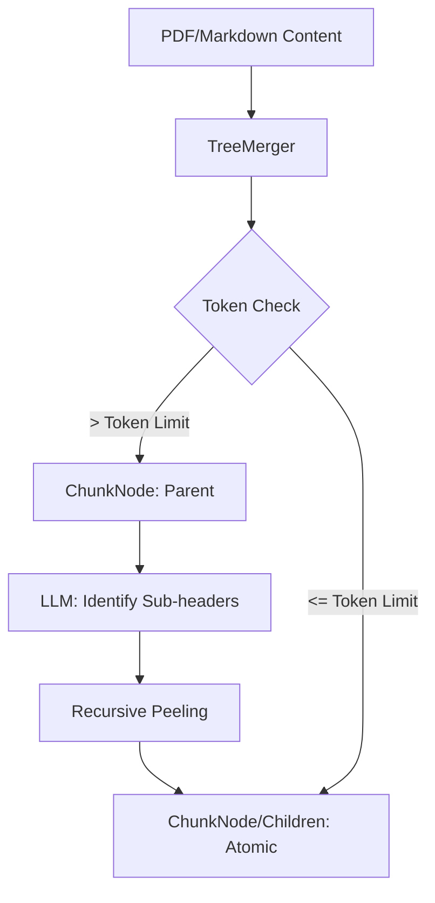

# Stage 2: 知识树结构 (Tree Representation) - 全链路深度拆解

本阶段解析 pdf2skill 项目的核心数据建模方式：使用 `ChunkNode` 层级结构来表示从大纲（TOC）到原子段落的转化过程。

## 0. 逻辑流转图 (Workflow Diagram)


---

## 第一部分：数据模型定义 (路径: [core/tree_merger.py](core/tree_merger.py))

### 1. `dataclass` 与 `field` 的应用
```python
@dataclass
class ChunkNode:
    id: str
    title: str
    parent_path: list
    children: list = field(default_factory=list)
    content: str = ""
    start_line: int = 0
    end_line: int = 0
    iteration: int = 0
    is_atomic: bool = False
```
- **Line 12**: **`@dataclass` 装饰器**: Python 3.7+ 引入的利器。它会自动为类生成 `__init__`、`__repr__`、`__eq__` 等方法。
  - **工程化意义**: 极大减少了样板代码（Boilerplate），使开发者专注于数据结构的定义。
- **Line 16**: **`field(default_factory=list)`**:
  - **底层原理**: 在 Python 中，如果直接写 `children: list = []`，所有的 `ChunkNode` 实例都会共享**同一个列表对象**（这是 Python 处理默认参数的经典坑）。
  - **解决方案**: `default_factory=list` 确保每个新实例被创建时，都会调用 `list()` 生成一个新的空列表，从而实现内存隔离。

### 2. 序列化与反序列化逻辑
```python
    def to_dict(self):
        return {
            "id": self.id,
            "title": self.title,
            "parent_path": self.parent_path,
            "children": [c.to_dict() for c in self.children],
            "content": self.content,
            "line_range": [self.start_line, self.end_line],
            "iteration": self.iteration,
            "is_atomic": self.is_atomic
        }
```
- **递归转换**: 注意 `children` 字段的列表推导式。由于知识树是层级结构，`to_dict` 必须递归调用子节点的 `to_dict`，直到叶子节点（`is_atomic=True`）。这种模式在处理嵌套 JSON 时非常经典。

---

## 第二部分：模糊匹配算法 (路径: [core/tree_merger.py](core/tree_merger.py))

### 1. 编辑距离 (Levenshtein Distance)
```python
from Levenshtein import distance as levenshtein_distance

# ...

threshold = max(2, anchor_len // 5) 
for i in range(len(content) - anchor_len + 1):
    window = content[i:i + anchor_len]
    dist = levenshtein_distance(anchor, window)
```
- **第三方库解析**: `Levenshtein` 库提供的是快速的 C 语言实现的字符串编辑距离算法。
- **算法原理**: `Levenshtein` 距离是指将一个字符串转换为另一个字符串所需的最少单字符编辑操作次数（插入、删除、替换）。
- **工程化考量**: 
  - **模糊匹配**: 由于 LLM 提取的标题可能与原文有细微差异（如空格、标点符号），直接用 `content.find()` 会失效。
  - **阈值控制**: `max(2, anchor_len // 5)` 是典型的**容错逻辑**。它保证了随着标题越长，允许的误差也越大，但至少允许 2 个字符的误差。

---

## 课后实战 Lab：配置系统分层训练 (Tiered Practice)

### 🧩 核心 Lab (必备：数据节点模型复刻)
**目标**：掌握 `dataclass` 的正确用法及其在树形结构中的应用。

**动手要求**：在 `docs/study_notes/labs/` 下创建 `lab_stage2_core.py`。
- [ ] **定义模型**: 定义一个 `SkillNode` 类，包含 `name: str` 和 `sub_skills: list`。
- [ ] **内存隔离验证**: 确保 `sub_skills` 使用了 `field(default_factory=list)`，并在主程序中创建两个实例，验证它们各自拥有独立的列表。
- [ ] **简单转换**: 实现一个 `print_structure()` 方法，能够递归打印出整棵树的名称。

---

### 🚀 实战 Lab (可选：构建微型搜索索引)
**目标**：应用编辑距离（Levenshtein）实现一个具备纠错能力的搜索器。

**动手要求**：在 `docs/study_notes/labs/` 下创建 `lab_stage2_search.py`。
- [ ] **安装依赖**: `pip install python-Levenshtein`。
- [ ] **实现纠错逻辑**: 写一个函数，接收用户输入的词，并从一个预定的列表（比如项目模块名）中找到最接近的一个（距离最小且在阈值内）。
- [ ] **模拟真实交互**: 当用户搜索 "tree_mergr" 时，系统成功返回 "tree_merger.py"。

---

### 🎓 导师 Review 提示
完成后贴出代码，我将重点检查：
1. **MRO/Dataclass 底层**: 你是否理解了 `default_factory` 解决了什么层面的 Python 内存问题？
2. **算法健壮性**: 在实战 Lab 中，你的搜索阈值是如何确定的？

---
/study-mentor
